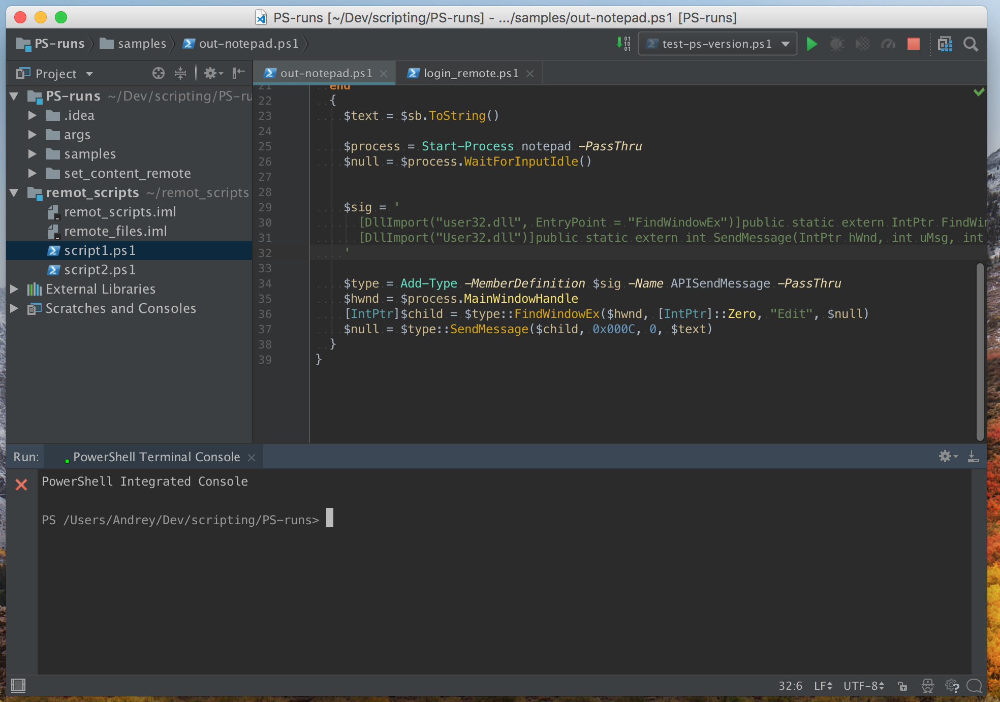
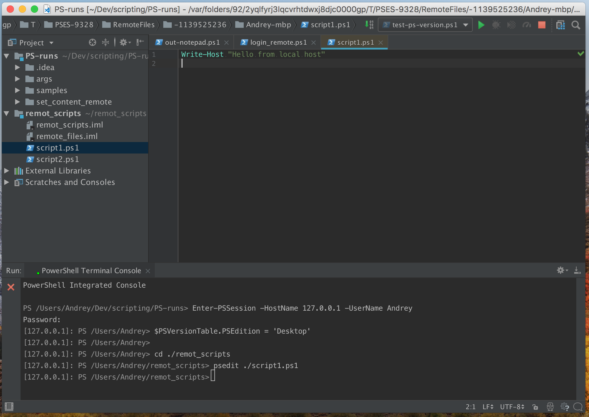
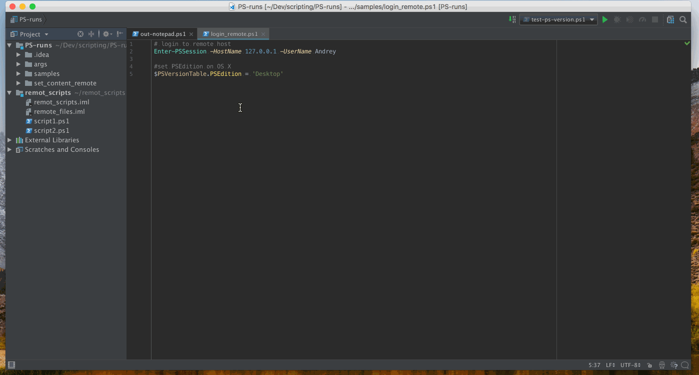

<!-- SPDX-FileCopyrightText: 2018 Andrey Dernov -->
<!-- SPDX-FileCopyrightText: 2026 intellij-powershell contributors <https://github.com/intellij-powershell/intellij-powershell> -->
<!-- SPDX-License-Identifier: Apache-2.0 -->

# Remote file editing with `psedit`

Fixed version: `1.1.1`.

To edit remote files, use the integrated PowerShell Console: **Tools | PowerShell Console…** action.

## Example

1. Open console: **Tools | PowerShell Console…** and in this PowerShell session log in to a remote host with `Enter-PSSession` PowerShell command, for example:

```powershell
Enter-PSSession -HostName 127.0.0.1 -UserName Andrey
```



2. Then open a remote file with `psedit` command, for example:

```powershell
psedit ./script1.ps1
```



Now you can edit the file (which is actually opened in a temporary location on your local host), and the console terminal session will automatically save it on a remote host.

Here is a short video recap:


